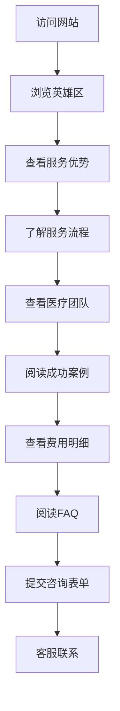

## 1. 产品概述
深度复刻geoivf.com的一站式医疗旅游网页，专注于格鲁吉亚试管婴儿服务。为寻求海外辅助生殖服务的用户提供专业、可信的信息展示平台。

目标用户：有海外试管婴儿需求的家庭、医疗旅游中介、生殖健康关注者。

## 2. 核心功能

### 2.1 用户角色
| 角色 | 访问方式 | 核心权限 |
|------|----------|----------|
| 访客用户 | 直接访问 | 浏览全部内容、查看服务信息、下载资料 |
| 咨询用户 | 填写咨询表单 | 获取个性化咨询、预约服务 |

### 2.2 功能模块
一站式单页滚动网站包含以下核心模块：

1. **首页导航区**: 品牌标识、导航菜单、多语言切换
2. **英雄展示区**: 主要服务介绍、核心卖点、行动按钮
3. **服务优势区**: 格鲁吉亚IVF优势、成功率、价格对比
4. **服务流程区**: 详细的IVF治疗步骤说明
5. **医疗团队区**: 医生介绍、诊所设施展示
6. **成功案例区**: 客户见证、成功故事
7. **费用明细区**: 透明定价、套餐对比
8. **常见问题区**: IVF相关知识、法律政策
9. **联系方式区**: 在线咨询、预约表单、联系信息

### 2.3 页面详情
| 页面区域 | 模块名称 | 功能描述 |
|----------|----------|----------|
| 导航头部 | 品牌导航 | 显示logo、主导航菜单、语言切换器，支持平滑滚动到对应区域 |
| 英雄展示 | 主视觉区 | 展示"格鲁吉亚试管婴儿"核心服务、高成功率卖点、立即咨询按钮 |
| 服务优势 | 优势对比 | 列出价格优势(比欧美便宜70%)、法律优势(商业代孕合法)、技术优势(欧洲标准) |
| 服务流程 | 流程步骤 | 展示7步IVF流程：初步评估→制定方案→促排卵→取卵取精→胚胎培养→胚胎移植→验孕确认 |
| 医疗团队 | 医生介绍 | 展示主治医生资历、诊所认证、实验室设备照片 |
| 成功案例 | 客户见证 | 展示真实客户反馈、成功率数据、宝宝照片(获得授权) |
| 费用明细 | 价格透明 | 详细列出各项目费用、套餐价格对比表、无隐藏费用承诺 |
| 常见问题 | FAQ模块 | 解答关于格鲁吉亚法律、治疗周期、住宿安排等常见问题 |
| 联系咨询 | 表单提交 | 提供在线预约表单、微信二维码、电话咨询、地址地图 |

## 3. 核心流程
用户访问流程：
1. 用户通过搜索引擎或直接输入网址访问网站
2. 首页英雄区域展示核心卖点，吸引用户继续浏览
3. 用户滚动查看服务优势、流程、团队等信息建立信任
4. 查看费用明细和成功案例消除顾虑
5. 通过FAQ解答最后疑虑
6. 填写咨询表单或拨打电话进行预约

## 4. 用户界面设计

### 4.1 设计风格
- **主色调**：医疗蓝(#2E86AB) + 纯白(#FFFFFF) + 温暖橙(#F24236)
- **按钮样式**：圆角矩形，主要按钮使用渐变效果
- **字体选择**：中文使用思源黑体，英文使用Roboto，标题24-32px，正文16px
- **布局风格**：现代化卡片式布局，大量留白，单页滚动设计
- **图标风格**：使用医疗相关线性图标，简洁专业

### 4.2 页面设计概述
| 页面区域 | 模块名称 | UI元素 |
|----------|----------|----------|
| 导航头部 | 导航栏 | 白色背景，蓝色logo，黑色导航文字，固定在顶部，滚动时添加阴影 |
| 英雄展示 | 主横幅 | 医疗主题背景图，蓝色渐变遮罩，白色大标题，橙色CTA按钮，响应式高度 |
| 服务优势 | 优势卡片 | 三栏卡片布局，蓝色图标，白色背景，轻微阴影悬停效果 |
| 服务流程 | 时间轴 | 垂直时间轴设计，蓝色步骤圆点，连接线，左右交替布局 |
| 医疗团队 | 医生卡片 | 圆形头像，资历标签，信任徽章，网格布局 |
| 成功案例 | 见证卡片 | 客户照片+文字，星级评分，绿色成功标签 |
| 费用明细 | 价格表格 | 清晰的表格设计，突出显示优惠价格，价格对比视觉效果 |
| 常见问题 | 折叠面板 | 手风琴式折叠，蓝色标题，简洁图标 |
| 联系咨询 | 表单区域 | 分两栏布局，左侧表单右侧联系信息，绿色提交按钮 |

### 4.3 响应式设计
- **桌面优先**：1440px基准设计，支持1920px宽屏
- **平板适配**：768px-1024px，调整网格为两栏布局
- **手机优化**：375px-767px，单栏布局，触摸友好的大按钮
- **加载优化**：图片懒加载，渐进式显示，移动端优先加载文本内容

### 4.4 医疗行业特殊要求
- **信任建立**：展示真实认证、医生执照、诊所照片
- **隐私保护**：用户数据加密传输，符合医疗数据保护规范
- **专业性**：使用准确的医学术语，提供权威信息来源
- **情感关怀**：温暖的色彩搭配，正面的成功案例，减少用户焦虑