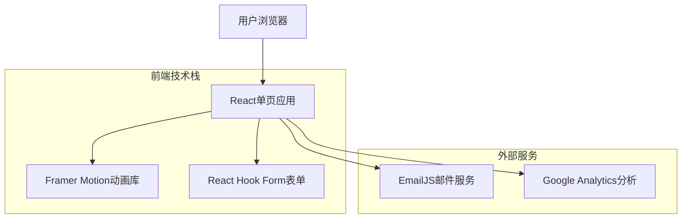

## 1. 架构设计



## 2. 技术描述

- **前端框架**: React@18 + Vite@4 + TypeScript@5
- **样式方案**: Tailwind CSS@3 + 自定义医疗主题
- **动画库**: Framer Motion@10 (滚动动画、页面过渡)
- **表单处理**: React Hook Form@7 + Zod@3 (表单验证)
- **邮件服务**: EmailJS@4 (咨询表单提交)
- **分析工具**: Google Analytics@4 (用户行为追踪)
- **初始化工具**: vite-init
- **部署方案**: Vercel/Netlify (静态部署)
- **后端**: 无 (纯静态网站，使用第三方邮件服务)

## 3. 路由定义

单页应用采用锚点滚动，无传统路由：

| 路由锚点 | 对应区域 | 用途 |
|----------|----------|------|
| #home | 英雄展示区 | 网站首页主视觉 |
| #advantages | 服务优势区 | 展示格鲁吉亚IVF优势 |
| #process | 服务流程区 | 详细介绍IVF步骤 |
| #team | 医疗团队区 | 展示医生和诊所信息 |
| #cases | 成功案例区 | 客户见证和成功率 |
| #pricing | 费用明细区 | 透明价格展示 |
| #faq | 常见问题区 | 解答用户疑问 |
| #contact | 联系方式区 | 咨询表单和联系信息 |

## 4. 核心组件架构

### 4.1 页面结构组件
```typescript
// 主应用组件
App.tsx
├── Header.tsx (固定导航栏)
├── HeroSection.tsx (英雄展示区)
├── AdvantagesSection.tsx (服务优势)
├── ProcessSection.tsx (服务流程)
├── TeamSection.tsx (医疗团队)
├── CasesSection.tsx (成功案例)
├── PricingSection.tsx (费用明细)
├── FAQSection.tsx (常见问题)
├── ContactSection.tsx (联系咨询)
└── Footer.tsx (页脚)
```

### 4.2 可复用组件
```typescript
// 通用组件库
components/
├── Button.tsx (主要按钮)
├── Card.tsx (信息卡片)
├── Section.tsx (区域容器)
├── Form.tsx (咨询表单)
├── Modal.tsx (弹窗组件)
├── Timeline.tsx (时间轴)
├── Accordion.tsx (折叠面板)
└── LazyImage.tsx (懒加载图片)
```

### 4.3 数据类型定义
```typescript
// 医生信息接口
interface Doctor {
  id: string;
  name: string;
  title: string;
  experience: string;
  specialties: string[];
  image: string;
  certifications: string[];
}

// 成功案例接口
interface SuccessCase {
  id: string;
  clientName: string;
  age: number;
  treatment: string;
  successStory: string;
  image?: string;
  rating: number;
  date: string;
}

// 价格套餐接口
interface PricingPackage {
  id: string;
  name: string;
  price: number;
  originalPrice?: number;
  features: string[];
  popular?: boolean;
  description: string;
}

// 咨询表单接口
interface ConsultationForm {
  name: string;
  email: string;
  phone: string;
  age: number;
  treatment: string;
  message: string;
  preferredContact: 'email' | 'phone' | 'wechat';
}
```

## 5. 性能优化策略

### 5.1 图片优化
- 使用WebP格式，提供jpg/png备用
- 响应式图片，移动端加载小尺寸
- 懒加载实现，首屏外图片延迟加载
- CDN加速，使用图片压缩服务

### 5.2 代码优化
- 组件懒加载，非首屏组件按需加载
- Tree Shaking，移除未使用代码
- 代码分割，按路由分割bundle
- 缓存策略，静态资源长期缓存

### 5.3 SEO优化
- 服务端渲染(SSR)或静态生成(SSG)
- 完整的meta标签和结构化数据
- 语义化HTML，正确使用标题层级
- XML网站地图和robots.txt

## 6. 第三方服务集成

### 6.1 邮件服务配置
```typescript
// EmailJS配置
const emailConfig = {
  serviceId: 'service_xxx',
  templateId: 'template_xxx',
  publicKey: 'user_xxx',
  // 邮件接收地址
  toEmail: 'info@geoivf.com'
};
```

### 6.2 分析工具集成
```typescript
// Google Analytics事件追踪
const trackEvent = (category: string, action: string, label?: string) => {
  gtag('event', action, {
    event_category: category,
    event_label: label,
  });
};

// 关键事件追踪
- 咨询表单提交
- 电话点击
- 页面滚动深度
- 按钮点击热力图
```

## 7. 部署和监控

### 7.1 部署流程
```bash
# 构建命令
npm run build

# 部署到Vercel
vercel --prod

# 环境变量
NEXT_PUBLIC_SITE_URL=https://geoivf.com
NEXT_PUBLIC_GA_ID=G-XXXXXXXXXX
NEXT_PUBLIC_EMAILJS_KEY=user_xxx
```

### 7.2 监控指标
- 页面加载时间(LCP < 2.5s)
- 首次输入延迟(FID < 100ms)
- 累积布局偏移(CLS < 0.1)
- 表单转化率(目标>5%)
- 页面跳出率(目标<40%)

### 7.3 备份策略
- 每日自动备份静态文件
- Git版本控制管理代码
- 图片资源云端备份
- 数据库(如有)定期导出